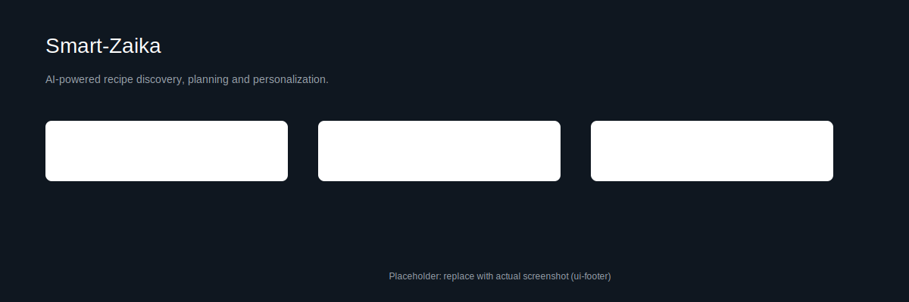
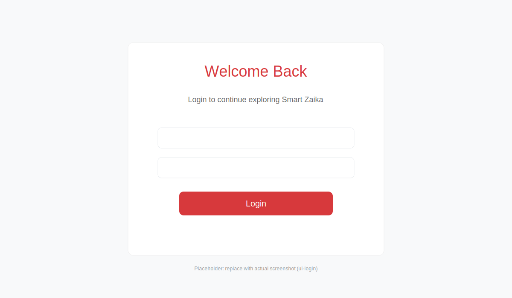
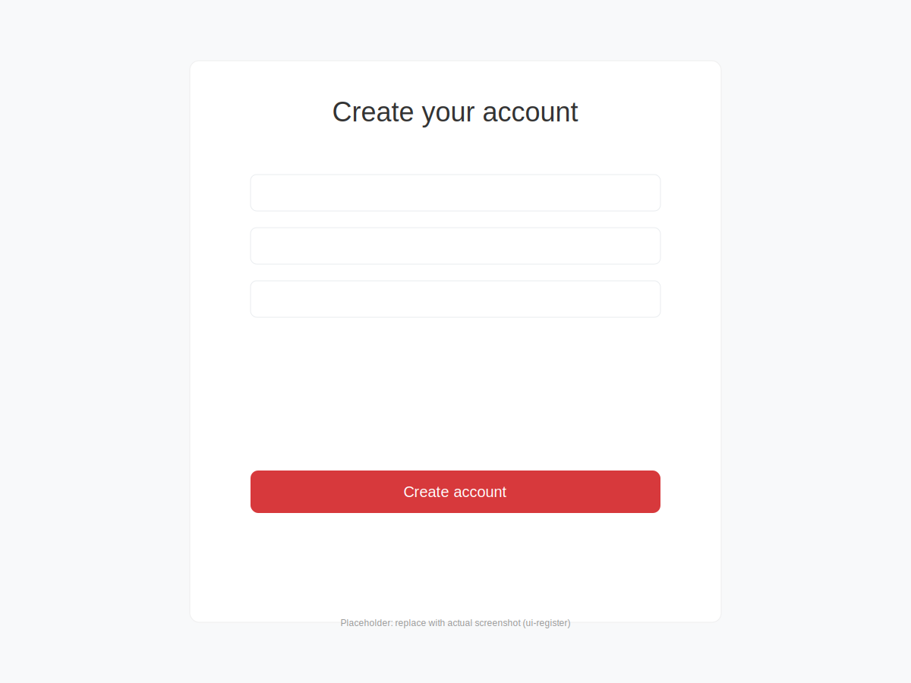

# Smart-Zaika

A simple Node.js + Express recipe web app with AI-assisted recipe generation, user accounts, and saved recipes.

## Features

- Browse recipes and view single recipe details
- User authentication (register, login, forgot password)
- Save recipes for later
- AI recipe generator (server-side integration)
- Server-rendered views using EJS

## Tech stack

- Node.js, Express
- MongoDB (via Mongoose)
- EJS templating
- Client-side JS for UI interactions

## Project structure (key files)

- `server.js` — app entry point
- `config/db.js` — database connection
- `routes/` — route definitions (`aiRoutes.js`, `recipeRoutes.js`, `userRoutes.js`)
- `controllers/` — controller logic (e.g., `userController.js`)
- `models/` — Mongoose models (e.g., `Recipe.js`, `User.js`, `SavedRecipe.js`)
- `views/` — EJS templates (pages and partials)
- `public/` — static assets (CSS, client JS, images)
- `scripts/seed.js` — optional seed data

## Prerequisites

- Node.js (16+ recommended)
- MongoDB instance (local or hosted)

## Environment variables

Create a `.env` file in the project root with at least:

- `PORT` — port to run the app (default: 3000)
- `MONGO_URI` — MongoDB connection string
- `SESSION_SECRET` — session cookie secret
- `OPENAI_API_KEY` (optional) — if AI generation uses OpenAI or similar

## Install

```bash
npm install
```

## Run locally

Start the app:

```bash
npm start
```

Or with nodemon (if installed):

```bash
npx nodemon server.js
```

The app serves server-rendered pages under `views/`. Static files are served from `public/`.

## Database

- The connection is configured in `config/db.js`.
- To seed sample data, run:

```bash
node scripts/seed.js
```

## Routes overview

- `/` — home and recipe listings
- `/recipes/:id` — single recipe view (`views/single-recipe.ejs`)
- `/saved-recipes` — logged-in users' saved recipes
- `/ai` — AI generation endpoints (see `routes/aiRoutes.js`)
- `/users` — authentication and user routes

## Development notes

- Views are EJS templates located in `views/` and `views/partials/`.
- Client-side scripts live in `public/js/` (e.g., `ai-generator.js`, `saved-recipes.js`).
- CSS files are in `public/css/`.

## Testing & Linting

There are no test scripts included by default. Add tests or linters as needed.

## Contributing

1. Fork the repo
2. Create a feature branch
3. Open a PR with a clear description

## Next steps

- Add instructions for CI, Docker, or deployment if desired.
- Add automated tests and linting rules.

## UI / Screenshot

The app uses a prominent hero header on the homepage with a background image, the site title "Smart-Zaika", a search input (placeholder: "egg, tomato, basil...") and a red "Generate" button. The top navigation contains the site logo and links (Recipes, About, Contact) and authentication links (Login, Register).

Below are screenshots of the UI. Files are stored in `public/images/`.

Homepage hero (search):



Login view:



Register view:



Replace these files in `public/images/` with higher-resolution PNG/JPG screenshots if you prefer.

---

